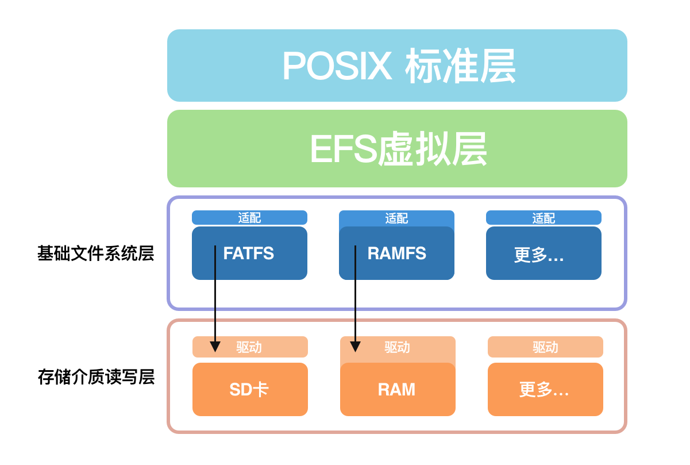

# ErisFS
A comprehensive virtual filesystem for FreeRTOS, build by x-Eris group.

## Component Structure
* POSIX standard layer
* ErisFS Virtual Layer
* Baisc Filesystem Layer (FATFS, RAMFS, ...)
* Storage Write / Read Layer (SD Card, RAM, ...)



## Code Structure
```
ErisFS
├── include
│   ├── efs_posix.h
│   ├── efs.h
│   ├── efs_file.h
│   ├── efs_fs.h
│   ├── efs_posix.h
│   ├── efs_utils.h
│ 
├── efs
│   ├── efs_posix.c
│   ├── efs.c
│   ├── efs_file.c
│   ├── efs_fs.c
│   ├── efs_posix.c
│   ├── efs_es.c
│   └── efs_utils.c
│ 
└── filesystem
    ├─── fatfs
    └─── ramfs
```

## Supported
**Posix File APIs:**
* open, close, read, write, rename, unlink, stat, fstat, creat, lseek, ftruncate ...
* mount, unmount, mkfs, statfs ...
* mkdir, rmdir ...

**Filesystems:**
* ramfs
* fatfs (with STM32F429IGT6)


## Usage
Please check the template file in ```replace```, which shows some basic usage of ErisFS (almost same with POSIX API).

Also, you can check ```include/efs_posix.h``` and ```include/efs_fs.h``` to find every functions' declaration.
